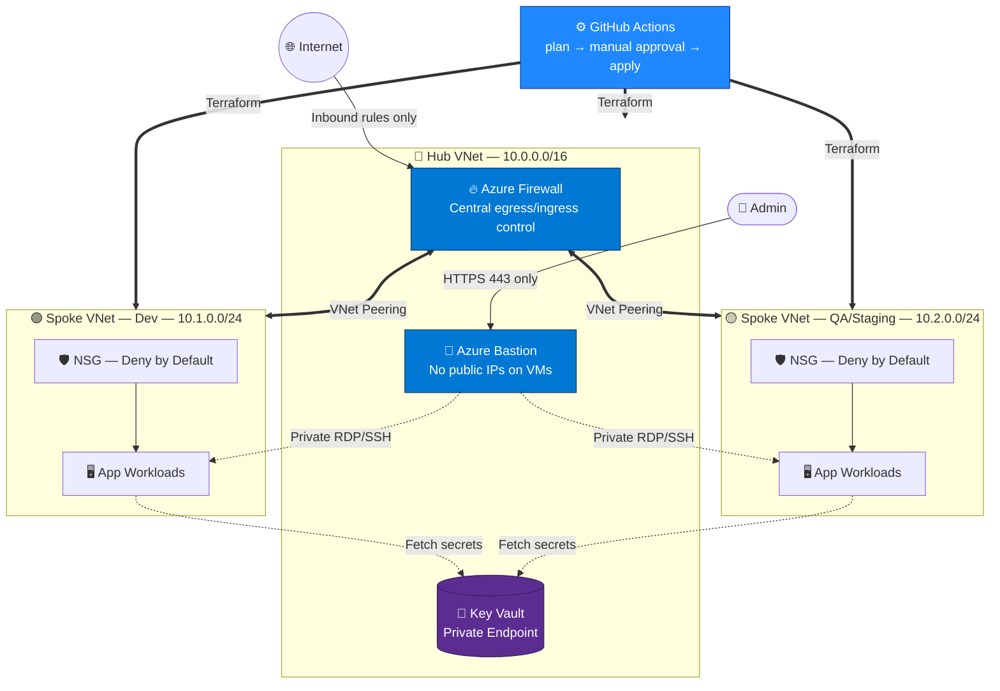
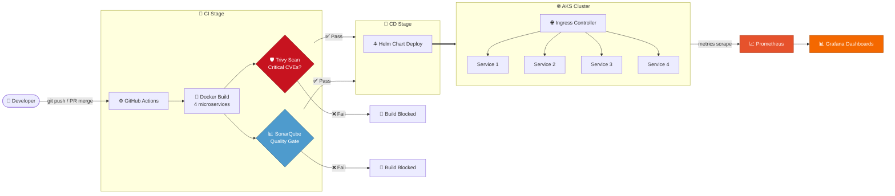
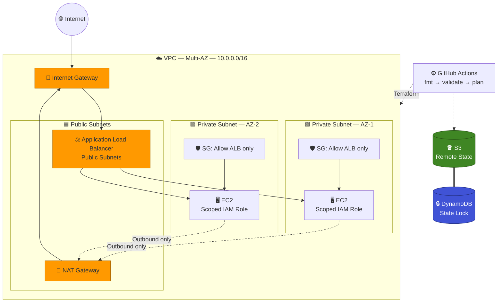

<div align="center">

# Hi, I'm Aniket Kumar 👋

### DevOps Engineer — Azure · AWS · Terraform · Kubernetes · CI/CD


---

⭐ From [Aniket Kumar](https://github.com/your-username)
es · CI/CD


[](https://linkedin.com/in/aniket484)
[](mailto:aniketkmr484@gmail.com)
[](https://github.com/aniket-devop)


</div>

<br/>

## 📌 About Me

DevOps Engineer with 1 year of hands-on experience automating cloud infrastructure and CI/CD pipelines on Microsoft Azure. I design infrastructure as code with Terraform, deploy and secure containerized workloads on Azure Kubernetes Service (AKS), and build security scanning and observability directly into the delivery pipeline instead of bolting it on afterward. Currently extending this foundation into AWS through a self-driven infrastructure project.

- 🔧 DevOps Intern @ **DevOps Insiders** — provisioning and maintaining Azure infrastructure across Dev, QA, and Staging
- 🌱 Building cross-cloud depth on AWS (VPC, EC2, ALB, IAM) through a personal landing-zone project
- 🎓 BCA, Chandigarh Group of Colleges, Mohali
- 📍 Noida, India
- 🎯 Looking for a full-time **Junior DevOps / Cloud Engineer** role

<br/>

## 🧰 Tech Stack

<div align="center">

           

</div>

| Category | Tools |
|---|---|
| **Cloud** | Microsoft Azure (VNets, Load Balancer, Firewall, Bastion, Key Vault, AKS), AWS (EC2, VPC, IAM, S3, ALB, DynamoDB) |
| **IaC** | Terraform — reusable modules, remote state, plan/apply workflows |
| **CI/CD** | GitHub Actions, Azure DevOps Pipelines |
| **Containers** | Docker, Kubernetes (AKS), Helm |
| **Security & Scanning** | Trivy, SonarQube, NSGs, scoped IAM |
| **Monitoring** | Prometheus, Grafana |
| **Scripting** | Python, Bash |
| **Version Control** | Git, GitHub |

<br/>

---

## 🏗️ Featured Projects

---

<br/>

## 1. Azure Landing Zone — Hub-and-Spoke Network

🔗 **Repo:** [azure-landing-zone-terraform](https://github.com/aniket-devop/azure-landing-zone-terraform)
`Terraform` `Azure Firewall` `Bastion` `Key Vault` `Private DNS` `GitHub Actions`

A hub-and-spoke enterprise network topology — the same pattern Microsoft recommends for real Azure landing zones — built entirely from reusable Terraform modules, with centralized security (Firewall + Bastion) and zero public exposure on workload VMs.

### Architecture Diagram



> 📎 A full icon-based (official Azure icon set) version of this diagram is included as [`diagrams/azure-landing-zone.drawio`](diagrams/azure-landing-zone.drawio) — open it in [draw.io](https://app.diagrams.net) for the enterprise-documentation look.

<details>
<summary><b>📖 Architecture Flow — click to expand</b></summary>

1. Admin connects to **Azure Bastion** over HTTPS (443) — no VM ever has a public IP.
2. Bastion proxies RDP/SSH internally to VMs in the spoke VNets.
3. All inter-VNet traffic between hub and spokes flows through **VNet Peering**, routed and inspected by **Azure Firewall**.
4. Outbound internet access from spokes is forced through the firewall (no direct egress from workloads).
5. Application secrets/connection strings are pulled from **Key Vault** via a **Private Endpoint** — never over the public Key Vault endpoint.
6. Every subnet in the spokes sits behind a **deny-by-default NSG**; only explicitly required ports are opened.
7. Infrastructure changes go through GitHub Actions: `terraform plan` and `validate` run automatically on every PR, and `apply` requires manual approval — no direct `apply` from a laptop.

</details>

<details>
<summary><b>📁 Folder Structure</b></summary>

```
azure-landing-zone-terraform/
├── modules/
│   ├── networking/       # Hub + spoke VNets, subnets, peering
│   ├── firewall/         # Azure Firewall + rule collections
│   ├── bastion/          # Bastion host + NSG
│   ├── key-vault/        # Key Vault + private endpoint
│   └── storage/          # Remote state backend resources
├── environments/
│   ├── dev/
│   ├── qa/
│   └── staging/
├── .github/
│   └── workflows/
│       └── terraform.yml
├── main.tf
├── variables.tf
├── outputs.tf
└── README.md
```

</details>

### ⚙️ Features
- Fully modular Terraform — each network component is an independently testable, reusable module
- Environment isolation via separate `.tfvars` per environment (dev/QA/staging) on shared modules
- Reduced new-environment provisioning time from days to **under 15 minutes**

### 🔒 Security
- Deny-by-default NSGs on every spoke subnet
- Zero public IPs on workload VMs — access only via Bastion
- Key Vault reachable only through a private endpoint
- Centralized egress/ingress inspection through Azure Firewall

### 🔁 CI/CD
`PR opened` → **GitHub Actions** runs `terraform fmt` + `validate` + `plan` → plan output posted for review → **manual approval gate** → `terraform apply` on merge.

### 🖥️ Commands
```bash
terraform init -backend-config=environments/dev/backend.tfvars
terraform plan -var-file=environments/dev/dev.tfvars
terraform apply -var-file=environments/dev/dev.tfvars
```

### 📚 Learning
Designing for peered networks forced me to think in terms of blast radius and centralized control points rather than per-VM security — the firewall and Bastion become the two chokepoints everything must pass through.

### 🚀 Future Improvements
- Add Azure Policy for automated compliance enforcement across spokes
- Integrate Private DNS Resolver for hybrid on-prem resolution
- Add a 3rd spoke for a shared-services tier (DNS, patch management)

<br/>

---

<br/>

## 2. DevSecOps Pipeline for Microservices on AKS

`AKS` `Docker` `Kubernetes` `Helm` `Trivy` `SonarQube` `Prometheus` `Grafana` `GitHub Actions`
*Repository not yet public — available on request.*

A commit-to-cluster pipeline for a 4-service application where **security and quality gates block the deploy**, not just warn about it — paired with live pod-health observability post-deploy.

### Architecture Diagram



> 📎 Official-icon version: [`diagrams/aks-devsecops.drawio`](diagrams/aks-devsecops.drawio)

<details>
<summary><b>📖 Architecture Flow — click to expand</b></summary>

1. Developer merges a PR — GitHub Actions triggers the pipeline.
2. All 4 services are containerized and built in parallel Docker build stages.
3. Every image is scanned by **Trivy**; any critical CVE **fails the pipeline** before deploy.
4. Code quality runs through **SonarQube**; a failed quality gate also blocks the merge from deploying.
5. Only after both gates pass does **Helm** deploy the release to AKS.
6. **Ingress** routes external traffic to the correct service based on path/host rules.
7. **Prometheus** scrapes pod and node metrics continuously; **Grafana** visualizes health, latency, and resource usage in real time.

</details>

<details>
<summary><b>📁 Folder Structure</b></summary>

```
aks-devsecops-pipeline/
├── services/
│   ├── service-1/
│   ├── service-2/
│   ├── service-3/
│   └── service-4/
├── helm/
│   ├── Chart.yaml
│   ├── values-dev.yaml
│   ├── values-prod.yaml
│   └── templates/
│       ├── deployment.yaml
│       ├── service.yaml
│       └── ingress.yaml
├── monitoring/
│   ├── prometheus-values.yaml
│   └── grafana-dashboards/
├── .github/
│   └── workflows/
│       └── ci-cd.yml
└── README.md
```

</details>

### ⚙️ Features
- Parallel multi-service builds to keep pipeline time down
- Helm-driven pod scaling, service config, and ingress rules — no manual `kubectl apply`
- Full commit-to-deploy automation, merged PR to running pod on AKS in **under 10 minutes**

### 🔒 Security
- Trivy blocks any image with a critical/high CVE from being deployed
- SonarQube enforces a quality gate (coverage, code smells, duplication) before merge
- No manual production deploys — everything routed through the pipeline

### 🔁 CI/CD
`Merge to main` → Docker build → **Trivy + SonarQube gates (parallel)** → both must pass → Helm upgrade/install → AKS rollout → Prometheus starts scraping new pods.

### 📈 Monitoring
- Prometheus scrapes CPU/memory/pod-restart metrics from the cluster
- Grafana dashboards track per-service health and resource usage
- Alerting rules configured for pod crash-loop and high resource utilization

### 🖥️ Commands
```bash
docker build -t registry/service-1:$(git rev-parse --short HEAD) ./services/service-1
trivy image registry/service-1:latest --severity CRITICAL,HIGH --exit-code 1
helm upgrade --install my-app ./helm -f helm/values-prod.yaml --namespace production
kubectl get pods -n production -w
```

### 📚 Learning
Treating security scans as **hard gates** rather than advisory reports was the biggest shift — it forces you to fix vulnerabilities before they ever reach a cluster, not patch them after the fact.

### 🚀 Future Improvements
- Add canary/blue-green rollout strategy via Argo Rollouts
- Add distributed tracing (OpenTelemetry) across the 4 services
- Externalize secrets to Azure Key Vault via CSI driver instead of K8s secrets

<br/>

---

<br/>

## 3. AWS Landing Network (Personal Project)

`Terraform` `VPC` `EC2` `ALB` `IAM` `S3` `DynamoDB`
*Repository not yet public — available on request.*

A self-driven project to build AWS depth using the same "no direct internet exposure" principle as the Azure landing zone — multi-AZ, private compute, and locked-down remote state.

### Architecture Diagram



> 📎 Official-icon version: [`diagrams/aws-landing-network.drawio`](diagrams/aws-landing-network.drawio)

<details>
<summary><b>📖 Architecture Flow — click to expand</b></summary>

1. All inbound traffic hits the **Internet Gateway**, then the **ALB** in the public subnets — nothing else is internet-facing.
2. The ALB forwards requests to EC2 instances in **private subnets across two AZs**, giving basic fault tolerance.
3. EC2 security groups accept traffic **only from the ALB's security group** — no direct internet access, no open ports.
4. Outbound-only internet access (package updates, external API calls) goes through the **NAT Gateway**.
5. Each EC2 instance assumes a **scoped IAM instance role** (least privilege) instead of a broad admin policy.
6. Terraform state is stored remotely in **S3**, with **DynamoDB** providing state locking to prevent concurrent-apply corruption.
7. Every PR runs `fmt`, `validate`, and `plan` via GitHub Actions before any human applies changes.

</details>

<details>
<summary><b>📁 Folder Structure</b></summary>

```
aws-landing-network/
├── modules/
│   ├── vpc/              # VPC, subnets, route tables, IGW, NAT
│   ├── alb/               # ALB, target groups, listeners
│   ├── ec2/               # Launch template, IAM instance role
│   └── state-backend/     # S3 + DynamoDB
├── environments/
│   └── dev/
│       ├── main.tf
│       └── dev.tfvars
├── .github/
│   └── workflows/
│       └── terraform.yml
└── README.md
```

</details>

### ⚙️ Features
- Multi-AZ design for basic high availability on the compute tier
- Fully private compute layer — EC2 instances have no public IPs
- Remote state with locking, safe for team/CI use without state corruption

### 🔒 Security
- Security groups scoped to ALB-only ingress on EC2
- IAM instance roles scoped to only the permissions the instance needs
- No inbound internet path to compute — only outbound, via NAT

### 🔁 CI/CD
`PR opened` → GitHub Actions runs `terraform fmt` → `validate` → `plan` → plan posted on PR for review → apply on approval/merge.

### 🖥️ Commands
```bash
terraform init
terraform fmt -check
terraform validate
terraform plan -var-file=environments/dev/dev.tfvars
terraform apply -var-file=environments/dev/dev.tfvars
```

### 📚 Learning
Setting up S3 + DynamoDB remote state from scratch made the "why" behind state locking concrete — without it, two people (or two pipeline runs) applying at once can corrupt state.

### 🚀 Future Improvements
- Add Auto Scaling Group instead of fixed EC2 count
- Add AWS WAF in front of the ALB
- Migrate compute to ECS Fargate to remove instance management entirely

<br/>

---

<br/>

## 💼 Professional Experience

**DevOps Intern — DevOps Insiders** · Aug 2025 – Jul 2026

- Automated provisioning of Azure resource groups, VNets, and VMs across dev, QA, and staging using reusable Terraform modules — cut environment setup from ~a day of manual work to under 30 minutes
- Built and maintained CI/CD pipelines (GitHub Actions + Azure DevOps Pipelines) for 3+ microservices, reducing manual deployment steps by ~70%
- Collaborated with a 4-person engineering team to resolve 15+ deployment issues (config drift, dependency mismatches, failed deploys) across three environments
- Implemented automated test stages ahead of deployment to surface failures earlier in the pipeline

<br/>

## 🎓 Education
**BCA — Chandigarh Group of Colleges, Mohali**  · CGPA: 7.63/10

<br/>

## 📊 GitHub Stats

<div align="center">


</div>

<br/>

## 📬 Contact

**Email:** [aniketkmr484@gmail.com](mailto:aniketkmr484@gmail.com) · **LinkedIn:** [linkedin.com/in/aniket484](https://linkedin.com/in/aniket484) · **GitHub:** [github.com/aniket-devop](https://github.com/aniket-devop)

Actively looking for full-time Junior DevOps / Cloud Engineering roles — happy to walk through any of the projects above in more depth.
