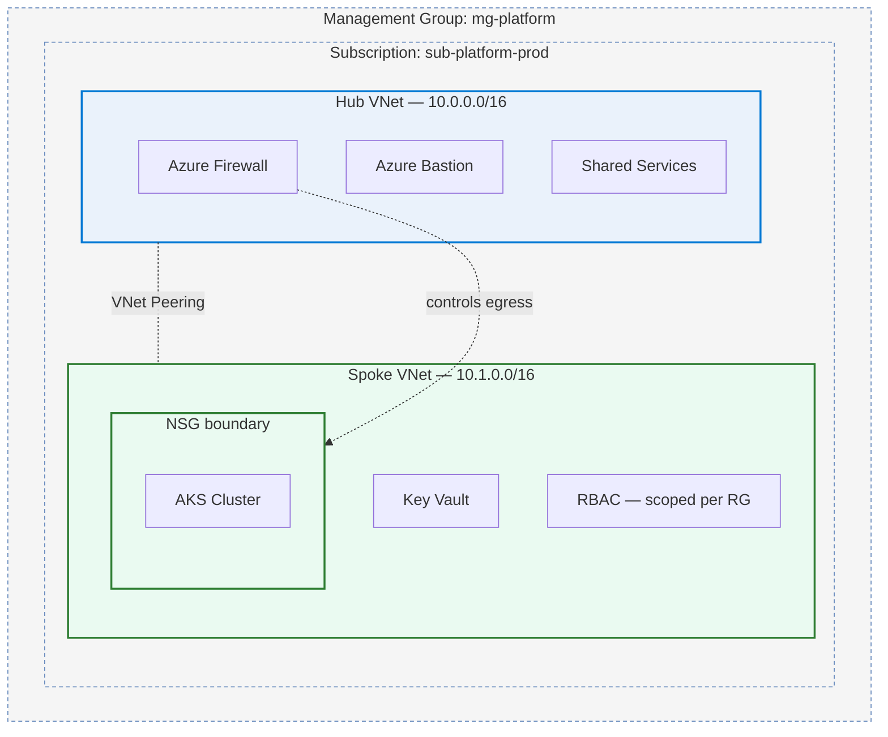
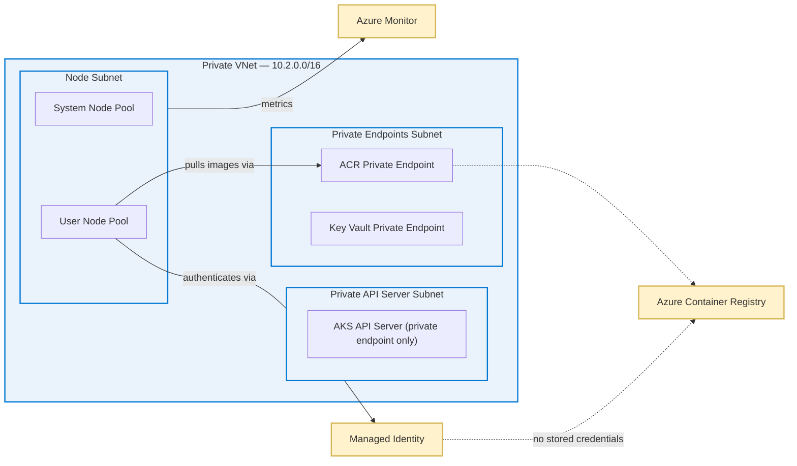

```mermaid
flowchart LR
    GIT["Git Push"] --> VAL["Terraform Validate"]
    VAL --> PLAN["Terraform Plan"]
    PLAN --> GATE

    subgraph GATE["Security Gate"]
        direction TB
        CHECKOV["Checkov — IaC scan"]
        TRIVY["Trivy — vuln scan"]
        SONAR["SonarQube — quality gate"]
    end

    GATE --> APPROVE["Manual Approval"]
    APPROVE --> APPLY["Terraform Apply"]
    APPLY --> AZURE["Azure"]
    AZURE --> MON["Monitoring"]

    classDef tf fill:#e6d9f2,stroke:#7B42BC,stroke-width:2px
    classDef gate fill:#fde8e6,stroke:#c0392b,stroke-width:2px
    classDef approve fill:#fff2cc,stroke:#d6b656,stroke-width:2px
    classDef azure fill:#dae8fc,stroke:#0078D4,stroke-width:2px
    class VAL,PLAN,APPLY tf
    class GATE,CHECKOV,TRIVY,SONAR gate
    class APPROVE approve
    class AZURE,MON azure
```

<table width="100%">
<tr>
<td width="45%" valign="top">

### 📌 At a Glance

| | |
|---|---|
| 🎓 **Education** | BCA, Chandigarh Group of Colleges |
| 💼 **Current** | DevOps Intern @ DevOps Insiders |
| 📍 **Based in** | Noida, India |
| 🎯 **Focus** | Azure IaC + Security-gated CI/CD |
| 🛠️ **Main tool** | Terraform |
| 🌱 **Learning** | OPA/Kyverno, Crossplane |

 

</td>
<td width="55%" valign="top">

### 👋 Why I build the way I do

I build small Azure environments in Terraform and spend most of my effort on the security and CI side of them. Getting a change to deploy is the easy part — getting it to deploy safely, with something checking the plan before it runs, is the part worth doing properly.

None of my projects are production infrastructure with real traffic. They're self-built, sized for one person to run and re-run. But I've tried to carry over the patterns a real environment needs: private networking, scoped access, gates before apply.

That judgment — not the tool list — is what I'm actually trying to build.

</td>
</tr>
</table>

 

---

## 🧰 Where I'm Solid vs. Still Building

<table width="100%">
<tr><th align="left" width="22%">Area</th><th align="left" width="45%">Tools</th><th align="left" width="33%">Comfort level</th></tr>
<tr><td>Cloud</td><td>Azure, Azure DevOps, Entra ID</td><td>🟢🟢🟢🟢🟢 Daily driver</td></tr>
<tr><td>IaC</td><td>Terraform, Bicep, Ansible</td><td>🟢🟢🟢🟢⚪ Terraform primary</td></tr>
<tr><td>Containers</td><td>Docker, Kubernetes, Helm, ArgoCD</td><td>🟢🟢🟢🟢⚪ Comfortable</td></tr>
<tr><td>CI/CD</td><td>Azure Pipelines, GitHub Actions, Jenkins</td><td>🟢🟢🟢🟢⚪ Azure Pipelines strongest</td></tr>
<tr><td>Security gates</td><td>Trivy, Checkov, SonarQube, Key Vault</td><td>🟢🟢🟢🟢⚪ Core to how I build</td></tr>
<tr><td>Monitoring</td><td>Prometheus, Grafana</td><td>🟢🟢🟢⚪⚪ Provision + basic dashboards</td></tr>
<tr><td>Scripting</td><td>Python, Bash, Git</td><td>🟢🟢🟢🟢⚪ Daily</td></tr>
<tr><td>Secrets mgmt</td><td>HashiCorp Vault</td><td>🟢🟢⚪⚪⚪ Sandbox only — being honest</td></tr>
</table>

 

## 💼 Experience

**DevOps Intern — DevOps Insiders** &nbsp;·&nbsp; `Feb 2025 – Present`

- Wrote Terraform modules provisioning Azure resource groups, VNets, and VMs for dev/QA/staging — replaced manual portal setup with version-controlled, repeatable infra
- Built and maintained GitHub Actions + Azure DevOps pipelines for 3+ microservices, with build/test/deploy stages triggered on PRs and merges
- Diagnosed config drift, dependency mismatches, and failed deployments across a 4-person team keeping three environments in sync
- Moved automated test stages ahead of deployment, catching failures before they reached staging

 

## 🚀 Projects — grouped by what actually runs together

Three write-ups instead of a longer list of small demos. The AKS cluster, how it gets deployed to, and how it's monitored are one system, not three separate portfolio pieces.

 

### 🏗️ 1 — Azure Landing Zone in Terraform
`Terraform` `Hub-and-Spoke` `Azure Firewall` `Bastion` `Key Vault` &nbsp;|&nbsp; 🔗 [Repo](https://github.com/aniket-devop/azure-landing-zone-terraform)

Started because I kept copy-pasting the same networking module between two "environments." Rebuilt as a proper hub-and-spoke setup instead.

<b>Design decisions — why, not just what</b>

 

- Hub-and-spoke instead of one flat network, so the firewall and Bastion live in one place instead of every spoke reinventing them
- NSGs at the spoke boundary (deny-by-default, explicit allow) so the AKS subnet isn't just trusting whatever's on the VNet
- Bastion instead of a jump box with a public IP — a mistake in an earlier version of this project I fixed on purpose here
- RBAC scoped to the resource group, not the subscription
- Firewall rule collections + UDRs forcing spoke egress through the firewall
- Key Vault behind a private endpoint with a Private DNS zone
- Remote state in Azure Storage with locking; `terraform fmt/validate/plan` on every PR with a manual approval gate before apply

Parameterized enough that a second "environment" is a tfvars change, not a duplicated module. That was the actual goal, more than the security stuff, if I'm honest.

 

### ☸️ 2 — Private AKS Platform: cluster + GitOps + observability
`AKS` `ArgoCD` `Helm` `Prometheus/Grafana` &nbsp;|&nbsp; 🔗 *repo link on request*

Started as "can I stand up an AKS cluster without a public API server," and grew to cover deployment and observability because I kept adding to it instead of starting something new each time I learned more.

<b>Cluster → GitOps → observability — how the pieces connect</b>

 

**The cluster:** module split (networking → security → identity → AKS → monitoring) came from trial and error — Terraform kept creating resources out of order because of implicit dependencies I hadn't thought through. Splitting fixed that. Core goal: AKS talks to ACR through a managed identity, nothing to rotate, nothing that leaks in a `.tfvars` file. Private endpoints for ACR and Key Vault.

**Deploying to it:** Helm charts hold desired state, ArgoCD reconciles and flags drift with self-healing — instead of finding out something changed when a pod is already crash-looping. Dev/staging/prod from one repo via Helm value overrides + ApplicationSets, rollback via ArgoCD revision history.

**Watching it:** Prometheus + Grafana provisioned by the same Terraform run as the cluster — dashboards exist from the first `apply`, not bolted on later. Alerting is still just defaults; real alert rules are next.

**What I haven't done:** no real load testing, haven't tried to break private endpoint routing or ArgoCD sync under actual traffic. Only run with a couple of test pods.

 

### 🔒 3 — Azure DevOps CI/CD + DevSecOps Pipeline
`Checkov` `Trivy` `SonarQube` `Terraform` &nbsp;|&nbsp; 🔗 *repo link on request*

Most pipeline examples I found online run security scans after you've already applied. By then the scan is just telling you what you already broke.

<b>Why the gate is before apply, not after</b>

 

Checkov and Trivy scan the `terraform plan` output before anything gets created, plus a SonarQube quality gate — if any fail, the pipeline stops. An early version just warned and continued, which defeats the point.

There's a manual approval step between plan and apply, kept deliberately rather than automated away. During the internship, a Terraform apply once did something I hadn't expected — since then I want a moment to actually read the plan before anything changes.

This pipeline (commit → build → scan → quality gate → deploy → monitor) is what deploys the landing zone and AKS platform above. Not a standalone demo — the gate for both.

 

---

## 📊 Activity

 

## 🔭 Right Now

- Azure Policy at the landing-zone level — governance I skipped the first time around
- OPA / Kyverno for admission control on the AKS project
- Actually testing Terraform modules instead of just running `plan` and eyeballing it
- Looking at Crossplane vs. the provider modules I use now — no strong opinion yet

 

**Open to DevOps / DevSecOps roles where I can keep building this judgment on real infrastructure.**

