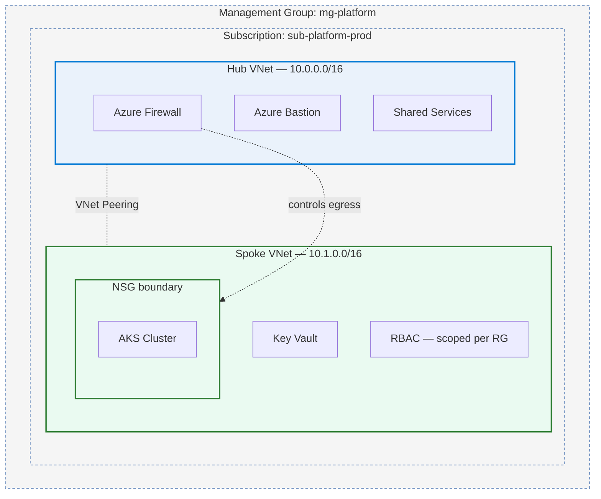
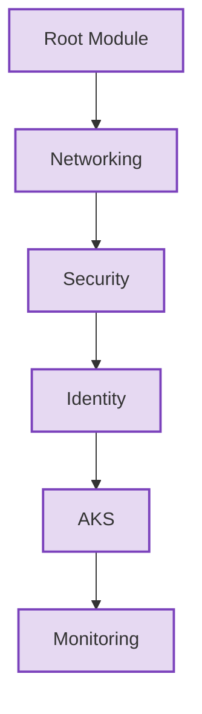
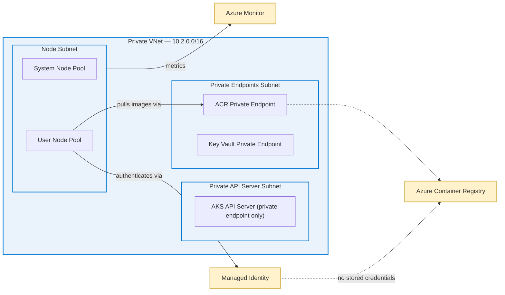
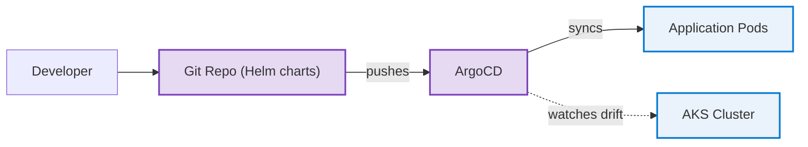
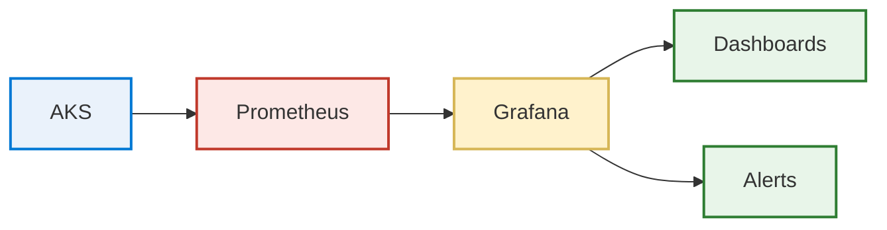

```mermaid
flowchart LR
    GIT["Git Push"] --> VAL["Terraform Validate"]
    VAL --> PLAN["Terraform Plan"]
    PLAN --> GATE

    subgraph GATE["Security Gate"]
        direction TB
        CHECKOV["Checkov — IaC scan"]
        TRIVY["Trivy — vuln scan"]
        SONAR["SonarQube — quality gate"]
    end

    GATE --> APPROVE["Manual Approval"]
    APPROVE --> APPLY["Terraform Apply"]
    APPLY --> AZURE["Azure"]
    AZURE --> MON["Monitoring"]

    classDef tf fill:#e6d9f2,stroke:#7B42BC,stroke-width:2px
    classDef gate fill:#fde8e6,stroke:#c0392b,stroke-width:2px
    classDef approve fill:#fff2cc,stroke:#d6b656,stroke-width:2px
    classDef azure fill:#dae8fc,stroke:#0078D4,stroke-width:2px
    class VAL,PLAN,APPLY tf
    class GATE,CHECKOV,TRIVY,SONAR gate
    class APPROVE approve
    class AZURE,MON azure
```

<div align="center">


<a href="https://linkedin.com/in/aniket484"></a>
<a href="mailto:aniketkmr484@gmail.com"></a>
<a href="https://github.com/aniket-devop"></a>


</div>

<br>

> I build small Azure environments in Terraform and spend most of my effort on the security and CI side of them. Getting a change to deploy is the easy part. Getting it to deploy safely is the part worth doing properly.

<br>

## 👋 About Me

I'm a BCA graduate (Chandigarh Group of Colleges, Mohali) currently doing a DevOps internship at **DevOps Insiders**, where I write Terraform modules, build CI/CD pipelines, and help keep dev/QA/staging environments in sync for a small team.

Outside of that role, I build Azure and Terraform projects on my own time to go deeper on things I don't always get to at work — landing zone patterns, private AKS clusters, pipelines that stop a bad change instead of just logging it after the fact.

None of this is production infrastructure with real traffic. It's self-built and sized for one person to run and re-run, but I've tried to carry over the patterns a real environment needs: private networking, scoped access, gates before apply. **That judgment is what I'm actually trying to build.**

```
🎓 BCA · Chandigarh Group of Colleges, Mohali   |   💼 DevOps Intern @ DevOps Insiders   |   📍 Noida, India
```

<br>

## 🧰 Tech Stack

<div align="center">

**Cloud & IaC**
<br>


**Containers & Orchestration**
<br>


**CI/CD & GitOps**
<br>

&nbsp;


**Security & Quality Gates**
<br>


**Monitoring**
<br>


**Languages**
<br>


</div>

<sub>Honest scoping: HashiCorp Vault — sandbox only, not a strength yet. Bicep/Ansible — used on select projects, Terraform is my main tool.</sub>

<br>

## 💼 Experience

<table>
<tr>
<td>

**DevOps Intern — DevOps Insiders**
`Feb 2025 – Present`

- Wrote Terraform modules to provision Azure resource groups, VNets, and VMs for dev, QA, and staging — replacing manual portal setup with version-controlled, repeatable infra
- Built and maintained GitHub Actions and Azure DevOps pipelines for 3+ microservices (build, test, deploy stages on PRs and merges)
- Diagnosed environment/integration issues — config drift, dependency mismatches, failed deployments — with a 4-person team
- Added automated test stages ahead of deployment steps, surfacing failures before builds reached staging

</td>
</tr>
</table>

<br>

## 🚀 Featured Projects

Three projects here instead of a longer list of smaller ones — grouping the pieces that actually run together (the AKS cluster, how it gets deployed to, how it's monitored) felt more honest than presenting them as separate demos.

<br>

<table>
<tr>
<td width="33%" valign="top">

### 🏗️ Landing Zone
**Hub-and-spoke Azure network in Terraform**

Firewall + Bastion in the hub, NSG-bound spokes, RBAC scoped per resource group, Key Vault behind a private endpoint.

`Terraform` `Azure Firewall` `Bastion` `Key Vault`

🔗 [Repo](https://github.com/aniket-devop/azure-landing-zone-terraform)

</td>
<td width="33%" valign="top">

### ☸️ Private AKS Platform
**Cluster + GitOps + observability**

Private API server, managed-identity ACR pulls, ArgoCD-driven deploys, Prometheus/Grafana from the first `apply`.

`AKS` `ArgoCD` `Helm` `Prometheus`

🔗 *Repo link on request*

</td>
<td width="33%" valign="top">

### 🔒 DevSecOps Pipeline
**Scan-before-apply CI/CD**

Checkov + Trivy + SonarQube gate the `terraform plan` output; manual approval before anything touches Azure.

`Checkov` `Trivy` `SonarQube`

🔗 *Repo link on request*

</td>
</tr>
</table>

<br>

<details>
<summary><b>1. Azure Landing Zone in Terraform — full write-up</b></summary>
<br>

Started because I kept copy-pasting the same networking module between two "environments." Rebuilt as a proper hub-and-spoke setup instead.



**What I went with, and why:**
- Hub-and-spoke instead of one flat network, so the firewall and Bastion live in one place instead of every spoke reinventing them
- NSGs at the spoke boundary (deny-by-default, explicit allow) so the AKS subnet isn't just trusting whatever's on the VNet
- Bastion instead of a jump box with a public IP — a mistake in an earlier version of this project I fixed on purpose here
- RBAC scoped to the resource group, not the subscription
- Firewall rule collections + UDRs forcing spoke egress through the firewall
- Key Vault behind a private endpoint with a Private DNS zone for internal resolution
- Remote state in Azure Storage with locking; `terraform fmt/validate/plan` on every PR with a manual approval gate before apply

Parameterized enough that a second "environment" is a tfvars change, not a duplicated module. That was the actual goal, more than the security stuff, if I'm honest.

</details>

<details>
<summary><b>2. Private AKS Platform — full write-up</b></summary>
<br>

The biggest of the three — kept adding to it instead of starting something new each time I learned a bit more. Started as "can I stand up an AKS cluster without a public API server," and grew to cover deployment and observability too.

**The cluster itself**

Default AKS quickstart tutorials leave the API server public and use a service principal secret for pulling from ACR. I wanted to avoid both.





The module split (networking → security → identity → AKS → monitoring) came out of trial and error, not planning — Terraform kept trying to create resources out of order because of implicit dependencies I hadn't thought through. Splitting fixed that.

Core goal: AKS talking to ACR through a managed identity — nothing to rotate, nothing that could leak in a `.tfvars` file by accident. Private endpoints for ACR and Key Vault so nothing goes over the public endpoint even inside the VNet.

**Getting things onto the cluster — ArgoCD + Helm**



Helm charts hold desired state; ArgoCD reconciles the cluster against them and flags drift with automated self-healing, instead of me finding out something changed when a pod is already crash-looping. Dev/staging/prod configs are managed from a single repo via Helm value overrides and ApplicationSets, with rollback via ArgoCD's revision history when a deploy goes bad.

**Knowing what's happening — Prometheus + Grafana**



Prometheus and Grafana are provisioned by the same Terraform run as the cluster, tracking pod health, CPU/memory, and request latency from the first `apply`. Alerting is still just the defaults — building out real alert rules is next.

**What I haven't done:** no real load testing, and I haven't tried to break private endpoint routing or ArgoCD sync under actual traffic. Everything above has only run with a couple of test pods.

</details>

<details>
<summary><b>3. Azure DevOps CI/CD + DevSecOps Pipeline — full write-up</b></summary>
<br>

Most pipeline examples I found online run security scans after you've already applied. By then the scan is just telling you what you already broke.



This pipeline runs Checkov and Trivy against the `terraform plan` output before anything gets created, plus a SonarQube quality gate — if any of them fail, the pipeline stops. An early version just warned and continued, which defeats the point.

There's a manual approval step between plan and apply, kept deliberately rather than automated away. During the internship, a Terraform apply once did something I hadn't expected — since then I want a moment to actually read the plan output before anything changes.

This pipeline (commit → build → scan → quality gate → deploy → monitor) is what deploys the landing zone and AKS platform above. It's not a standalone demo, it's the gate for both.

</details>

<br>

## 📊 GitHub Stats

<div align="center">


</div>

<br>

## 🔭 What I'm Working On Right Now

- Azure Policy at the landing-zone level — governance I skipped the first time around
- OPA / Kyverno for admission control on the AKS project
- Actually testing Terraform modules instead of just running `plan` and eyeballing it
- Looking at Crossplane as an alternative to the provider modules I've been using — no strong opinion yet

<br>

## 📫 Let's Connect

<div align="center">

<a href="https://linkedin.com/in/aniket484"></a>
<a href="mailto:aniketkmr484@gmail.com"></a>
<a href="https://github.com/aniket-devop"></a>

<br><br>


</div>

