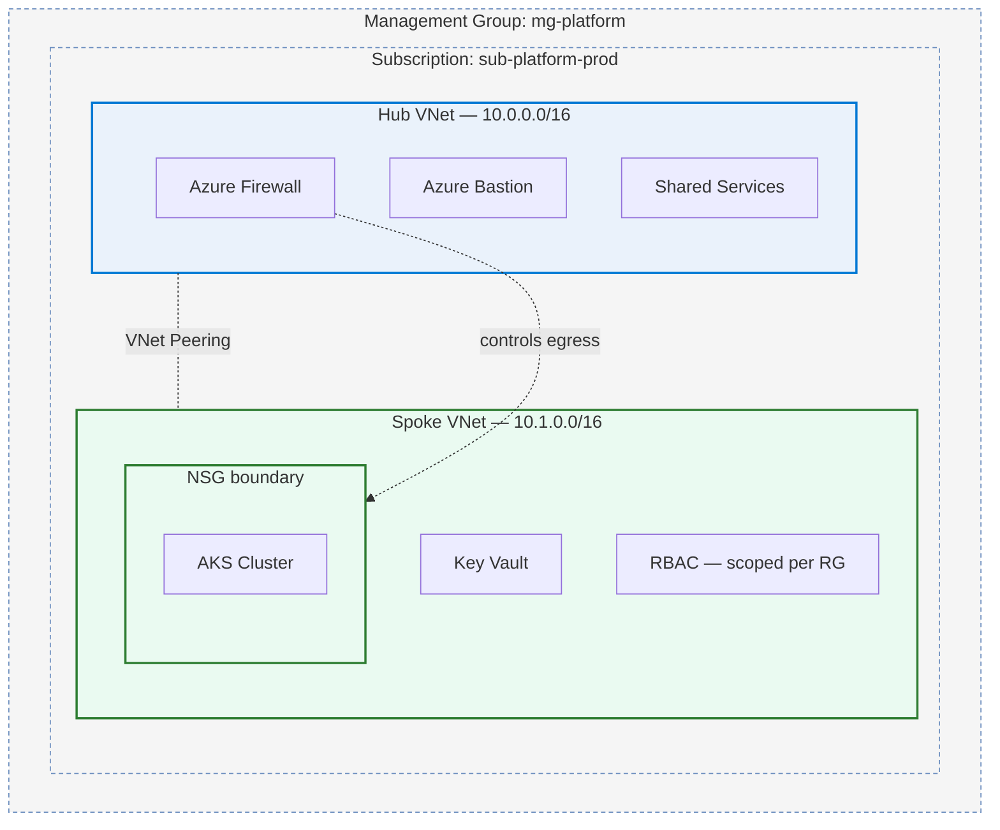
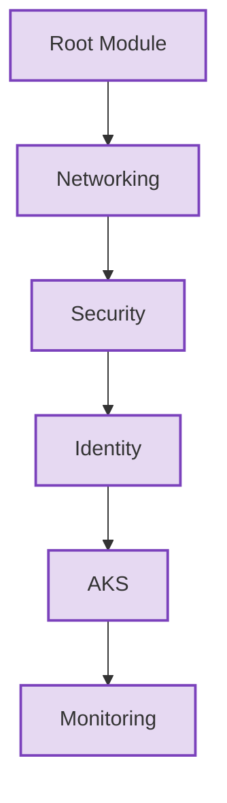
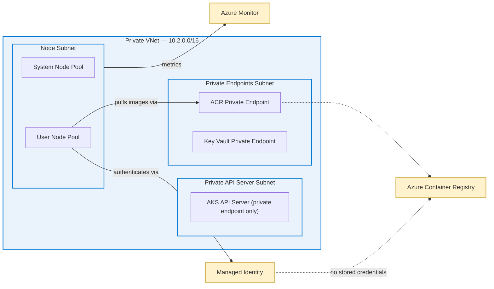
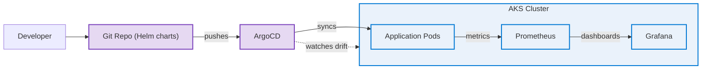
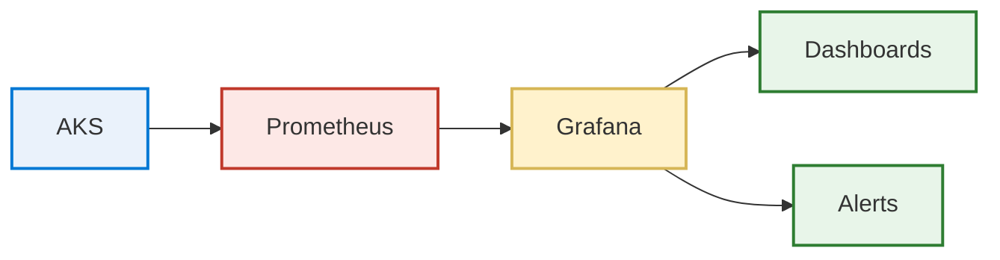

```mermaid
flowchart LR
    GIT["Git Push"] --> VAL["Terraform Validate"]
    VAL --> PLAN["Terraform Plan"]
    PLAN --> GATE

    subgraph GATE["Security Gate"]
        direction TB
        CHECKOV["Checkov — IaC scan"]
        TRIVY["Trivy — vuln scan"]
        SONAR["SonarQube — quality gate"]
    end

    GATE --> APPROVE["Manual Approval"]
    APPROVE --> APPLY["Terraform Apply"]
    APPLY --> AZURE["Azure"]
    AZURE --> MON["Monitoring"]

    classDef tf fill:#e6d9f2,stroke:#7B42BC,stroke-width:2px
    classDef gate fill:#fde8e6,stroke:#c0392b,stroke-width:2px
    classDef approve fill:#fff2cc,stroke:#d6b656,stroke-width:2px
    classDef azure fill:#dae8fc,stroke:#0078D4,stroke-width:2px
    class VAL,PLAN,APPLY tf
    class GATE,CHECKOV,TRIVY,SONAR gate
    class APPROVE approve
    class AZURE,MON azure
```

# Aniket Kumar

**DevOps Intern — Azure, Terraform, Kubernetes**

I spend most of my time building small Azure environments in Terraform and trying to get the security/CI side of them right, not just the "it deploys" part.

 

## About

I'm a BCA grad who did a 1-year DevOps internship, and outside of that I build small Azure/Terraform projects on my own to practice the stuff I don't get enough hands-on time with at work — mainly landing zone patterns, private AKS clusters, and pipelines that actually block bad changes instead of just running after the fact.

None of this is production infrastructure with real traffic. It's self-built, sized for one person to run and re-run, but I've tried to follow the same patterns (private networking, scoped access, gates before apply) that a real environment would need, since that's the part I actually want to get good at.

 

## Stack

<table>
<tr>
<td valign="top" width="50%">

**Cloud**
 

Azure, Azure DevOps, Entra ID — day-to-day comfortable with these

**Infrastructure as Code**
 

Terraform (main tool I use), some Bicep, Ansible for config management on a couple of projects

**Containers & Orchestration**
 

Docker, Kubernetes, Helm, ArgoCD

</td>
<td valign="top" width="50%">

**CI/CD**
 

Azure Pipelines mostly, GitHub Actions for personal repos, a bit of Jenkins

**Security scanning**

Trivy and Checkov in pipelines, SonarQube for code quality, Key Vault for secrets. HashiCorp Vault I've only used in a sandbox, not comfortable calling that a strength yet.

**Monitoring**
 

Prometheus + Grafana, provisioned alongside infra rather than bolted on after

**Languages & VCS**
 

Python and Bash for scripting/automation, Git daily

</td>
</tr>
</table>

 

## Projects

A quick note before these: repos are being cleaned up (removing hardcoded values I used while testing, adding proper `.tfvars.example` files) before I make them public one at a time. I'll link each one here as it's ready instead of leaving dead links sitting around.

 

### 1. Azure Landing Zone in Terraform

This one started because I kept copy-pasting the same networking module between two "environments" and got tired of it. So I rebuilt it as a proper hub-and-spoke setup instead.

*(Cleaner diagram with proper Azure icons — adding it as `diagrams/landing-zone.png` once I export one properly.)*

What I went with, and why:

- Hub-and-spoke instead of one flat network — mainly so the firewall and Bastion live in one place instead of every spoke reinventing them
- NSGs at the spoke boundary so the AKS subnet isn't just trusting whatever's on the VNet
- Bastion instead of a jump box with a public IP — this was actually a mistake I made in an earlier version of this project (had a VM with a public IP for "just testing"), so I fixed it here on purpose
- RBAC scoped to the resource group, not the subscription, because I didn't want one broad role assignment covering everything

It's parameterized enough that I can spin up a second "environment" by changing tfvars instead of duplicating the whole module — that was the actual goal, more than the security stuff, if I'm honest.

**Repo:** cleaning up before publishing — will link here once it's done

 

### 2. Private AKS Cluster + ACR (no static credentials)

The default AKS quickstart tutorials all leave the API server public and use a service principal secret for pulling from ACR. I wanted to see if I could avoid both.

The module split (networking → security → identity → AKS → monitoring) came out of trial and error, not planning — I originally had everything in one module and Terraform kept trying to create resources out of order because of implicit dependencies I hadn't thought through. Splitting it fixed that and made it obvious what depends on what.

The main thing I wanted working: AKS talking to ACR through a managed identity, with nothing to rotate and nothing that could leak in a `.tfvars` file by accident. Private endpoints for ACR and Key Vault so nothing goes over the public endpoint even inside the VNet.

Still on my list: I haven't load-tested this or tried to break the private endpoint routing under real traffic — it's only ever run empty or with a couple of test pods.

**Repo:** cleaning up before publishing — will link here once it's done

 

### 3. Pipeline that actually blocks bad Terraform

Small thing that annoyed me: most of the pipeline examples I found online run security scans *after* you've already applied. By then the scan is just telling you what you already broke.

So this pipeline runs Checkov and Trivy against the `terraform plan` output before anything gets created, plus a SonarQube quality gate. If any of them fail, the pipeline stops — it doesn't just warn and continue, which is what I had in an early version and quickly realized defeats the point.

I kept a manual approval step between plan and apply on purpose. Partly because automated scans don't catch everything, and partly because I wanted a moment to actually read the plan output myself before anything changes — habit I picked up after a Terraform apply once did something I didn't expect during the internship.

**Repo:** cleaning up before publishing — will link here once it's done

 

### 4. GitOps deploys with ArgoCD

Got tired of `kubectl apply`-ing manually and then forgetting what I'd changed a week later, so I moved deployments to ArgoCD.

Helm charts hold the desired state, ArgoCD reconciles the cluster against them and flags drift instead of me finding out something changed when a pod is already crash-looping. Also means I stopped needing a `kubectl` context with write access on my own laptop for day-to-day deploys, which is a smaller win but a real one.

Nothing exotic here — this is the smallest and most "textbook" of these projects. I built it mostly to get comfortable with the sync/drift workflow, not because I hit some interesting problem along the way.

**Repo:** cleaning up before publishing — will link here once it's done

 

### 5. Monitoring with Prometheus + Grafana

Smallest project of the five, and I'll be upfront that it's the least developed. Point of it was just to stop treating monitoring as a thing you add after infra exists — so Prometheus and Grafana get provisioned in the same Terraform run as the cluster.

Dashboards exist from the first `terraform apply` instead of being something I remember to add three weeks later. That's really the whole idea — I haven't built out alerting rules beyond the defaults yet, that's next.

**Repo:** cleaning up before publishing — will link here once it's done

 

## GitHub Activity

<table>
<tr>
<td></td>
<td></td>
</tr>
</table>

 

## What I'm working on right now

- Azure Policy at the landing-zone level — governance stuff I skipped the first time around
- OPA / Kyverno for admission control on the AKS project
- Actually testing Terraform modules instead of just running `plan` and eyeballing it
- Looking at Crossplane as an alternative to the provider modules I've been using — no strong opinion yet, just curious

 

## Contact

