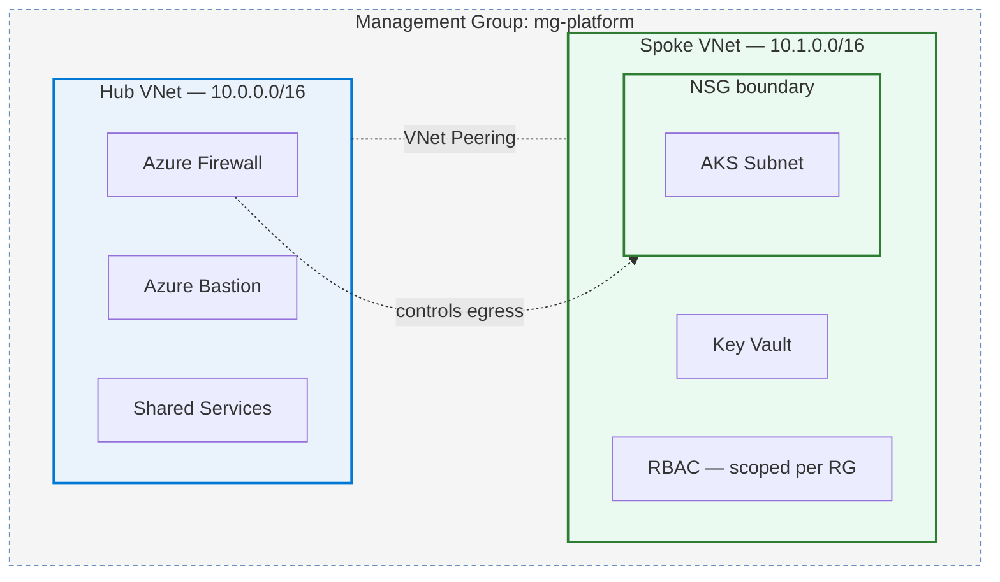

# Hi, I'm Aniket Kumar 👋

**DevOps Engineer — Azure, Terraform, Kubernetes**

I build small cloud environments in Terraform and spend most of my effort on the security and CI side of them. Getting a change to deploy is the easy part. Getting it to deploy safely is the part worth doing properly.

**Open to full-time DevOps / Cloud Engineering opportunities** — immediate joiner, based in Noida, open to remote.

[](https://linkedin.com/in/aniket484) [](mailto:aniketkmr484@gmail.com) [](https://github.com/aniket-devop)

## About Me

I'm a BCA graduate (Chandigarh Group of Colleges, Mohali) currently doing a DevOps internship at **DevOps Insiders**, where I write Terraform modules, build CI/CD pipelines, and help keep dev/QA/staging environments in sync for a small team.

Outside of that role, I build Azure and AWS projects on my own time to go deeper on things I don't always get to at work — landing zone patterns, GitOps delivery, pipelines that stop a bad change instead of just logging it after the fact.

None of this is production infrastructure with real traffic. It's self-built and sized for one person to run and re-run, but I've tried to carry over the patterns a real environment needs: scoped access, gates before apply, no long-lived credentials sitting around. That judgment is what I'm actually trying to build.

## 🧰 Core Stack

- **Cloud:** Azure, AWS
- **Infrastructure as Code:** Terraform (main tool I use)
- **Containers & Orchestration:** Docker, Kubernetes (AKS), Helm, ArgoCD
- **CI/CD:** GitHub Actions, Azure DevOps Pipelines
- **Security scanning:** Trivy, Checkov, tfsec, TFLint
- **Monitoring:** Prometheus, Grafana
- **Languages & VCS:** Python, Bash, Git

## 🚀 Featured Projects

Four projects here — each links to a public repo so you can read the actual code, not just this description.

### 1. GitOps CI/CD Pipeline

🔗 [gitops-demo-app](https://github.com/aniket-devop/gitops-demo-app) (application) · [gitops-k8s-config](https://github.com/aniket-devop/gitops-k8s-config) (cluster config)

Most pipeline examples I looked at either deploy directly from CI or skip scanning entirely. I wanted a setup where CI never touches the cluster, and nothing with a known CRITICAL vulnerability gets published.

*(No architecture diagram in this repo yet — the config repo's docs are still a work in progress, noted honestly below.)*

**What I went with, and why:**
- Two separate repos (app + config) instead of one, so the app's CI can't accidentally apply anything to the cluster — ArgoCD is the only thing that touches it
- Commit-SHA image tagging, not `latest`, so a rollback means pointing at a specific known-good SHA, not guessing
- A CRITICAL vulnerability gate that fails the build, not just warns — an early version of this just logged the finding and moved on, which defeats the point
- ArgoCD's automated sync + self-healing + pruning, so drift gets corrected instead of discovered later, plus Git-based rollback through the config repo's history

**Tech:** FastAPI, Docker, GitHub Actions, Trivy, GHCR, Helm, ArgoCD, Kubernetes (Kind)

**Note:** the config repo's own documentation is still in progress — the application repo is complete and working, but I'd rather say that plainly than paper over it.

### 2. Azure Landing Zone in Terraform

🔗 [Repo](https://github.com/aniket-devop/azure-landing-zone-terraform)

Started because I kept copy-pasting the same networking module between two "environments." Rebuilt as a proper hub-and-spoke setup instead — a second environment is now a `tfvars` change, not a duplicated module.



**What I went with, and why:**
- Hub-and-spoke instead of one flat network, so the firewall and Bastion live in one place instead of every spoke reinventing them
- NSG at the spoke boundary (deny-by-default) so the AKS subnet isn't just trusting whatever's on the VNet
- Bastion instead of a jump box with a public IP — a mistake in an earlier version of this project I fixed on purpose here
- RBAC scoped to the resource group, not the subscription — no broad Owner/Contributor role covering everything
- Remote state with locking; `terraform fmt/validate/plan` on every PR before apply

**What it doesn't do yet:** no Azure Policy at the management-group level, no private endpoint on the Key Vault in this repo specifically (that pattern lives elsewhere), and nothing here has run under real traffic — `terraform destroy` is the only thing that's been tested end-to-end.

**Tech:** Terraform, Azure Firewall, Azure Bastion, Key Vault, RBAC

### 3. Airflow Observability Pipeline (Freelance)

🔗 [Repo](https://github.com/aniket-devop/airflow-docker-grafana-monitoring)

Built for a freelance client. The official Airflow Docker Compose template ships with CeleryExecutor and a Redis-backed worker queue — built for distributing tasks across multiple workers. For a single-node deployment that's unnecessary complexity, so I replaced it with LocalExecutor + PostgreSQL and kept every other production-relevant pattern (health checks, dependency ordering, persistent metadata storage).


**What I went with, and why:**
- LocalExecutor over CeleryExecutor + Redis — no separate worker fleet or message broker needed at this scale, and it removes an entire class of infra to maintain for no corresponding benefit
- StatsD → StatsD Exporter → Prometheus, because Airflow doesn't expose a native Prometheus endpoint in this setup — the exporter is the standard bridge
- Docker Compose health checks and service dependency ordering so the stack comes up in the right order, not by luck

**Honest scope:** no pre-provisioned Grafana dashboards or alerting — Prometheus is reachable and scraping correctly (confirmed via the target-health check and by querying ~129 `airflow_*` metrics live in Grafana), but dashboards and alert rules are a manual next step, not automated by this repo yet.

**Tech:** Docker Compose, Apache Airflow, PostgreSQL, StatsD, StatsD Exporter, Prometheus, Grafana

### 4. AWS Landing Zone in Terraform

🔗 [Repo](https://github.com/aniket-devop/aws-terraform-landing-zone-project)

Wanted to see the AWS equivalent of the Azure landing zone above — a small, modular, multi-AZ foundation instead of a single-instance demo.

```
                      Internet
                         │
                ┌────────▼────────┐
                │ Internet Gateway │
                └────────┬────────┘
                         │
┌────────────────────────┴────────────────────────┐
│                        VPC 10.0.0.0/16            │
│                                                    │
│   AZ-a                              AZ-b           │
│  ┌──────────────────┐        ┌──────────────────┐ │
│  │ Public Subnet     │        │ Public Subnet     │ │
│  │ 10.0.0.0/24       │        │ 10.0.1.0/24       │ │
│  │  ┌───────────┐    │        │   ┌───────────┐   │ │
│  │  │ NAT GW-a  │    │        │   │ NAT GW-b  │   │ │
│  │  └───────────┘    │        │   └───────────┘   │ │
│  │        ALB (spans both public subnets)          │ │
│  └─────────┬─────────┘        └─────────┬─────────┘ │
│            │                             │           │
│  ┌─────────▼─────────┐        ┌─────────▼─────────┐ │
│  │ Private Subnet     │        │ Private Subnet     │ │
│  │ 10.0.10.0/24       │        │ 10.0.11.0/24       │ │
│  │  ┌──────────────┐  │        │  ┌──────────────┐  │ │
│  │  │  EC2 app-1   │  │        │  │  EC2 app-2   │  │ │
│  │  └──────────────┘  │        │  └──────────────┘  │ │
│  └────────────────────┘        └────────────────────┘ │
└────────────────────────────────────────────────────────┘
```

**What I went with, and why:**
- EC2 instances in private subnets only — the ALB is the sole entry point, nothing is directly internet-reachable
- No SSH key; IAM role + SSM Session Manager instead, removing an entire class of risk (leaked keys, open port 22) in favor of auditable, IAM-governed access
- Security groups reference each other instead of CIDR ranges, so the rule stays correct even if the ALB's IP changes
- GitHub Actions CI authenticates via OIDC (no long-lived AWS access keys as repo secrets) and only runs `fmt`/`validate`/`plan` — `apply` stays a manual, human-triggered step

**What I'd add before this ran real traffic:** HTTPS on the ALB, an Auto Scaling Group instead of two static instances, and a WAF — all listed explicitly in the repo's own "improvements" section.

**Tech:** Terraform, AWS VPC, ALB, EC2, IAM, Systems Manager, GitHub Actions (OIDC)

## 💼 Experience

**DevOps Intern — DevOps Insiders** *(Aug 2025 – present)*

- Wrote Terraform modules to provision Azure resource groups, VNets, and VMs for dev, QA, and staging — replacing manual portal setup with version-controlled, repeatable infra
- Built and maintained CI/CD pipelines (GitHub Actions and Azure DevOps) automating build, test, and deployment across environments
- Deployed a 4-service IoT telemetry platform on AKS using Docker, Kubernetes, and Helm
- Integrated Terraform validation and security checks (`fmt`, `validate`, TFLint, tfsec, Checkov) into CI/CD
- Configured Prometheus and Grafana dashboards to monitor application health, pod health, and resource utilization
- Diagnosed environment/integration issues — config drift, dependency mismatches, failed deployments — and applied fixes to restore successful deployments

## 📊 GitHub Activity


## 🔭 What I'm Working On Right Now

- Azure Policy at the landing-zone level — governance I skipped the first time around
- OPA / Kyverno for admission control on Kubernetes workloads
- Actually testing Terraform modules instead of just running `plan` and eyeballing it
- Looking at Crossplane as an alternative to the provider modules I've been using — no strong opinion yet

## 📫 Contact

[](https://linkedin.com/in/aniket484) [](mailto:aniketkmr484@gmail.com) [](https://github.com/aniket-devop)
