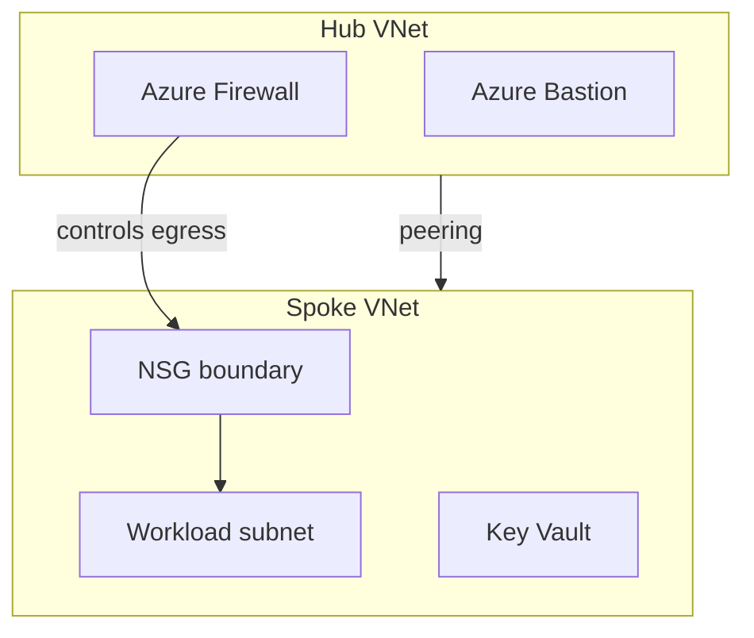
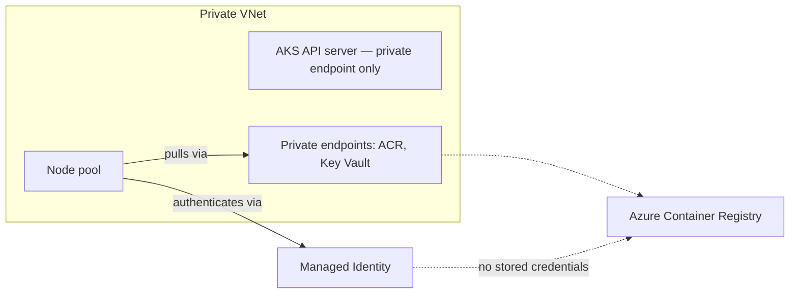
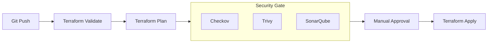

# Aniket Kumar

**DevOps Engineer | Azure · Terraform · Kubernetes**

Turning Microsoft's reference architectures into infrastructure I've actually stood up and broken myself.

 

## About

I spent a year as a DevOps intern at DevOps Insider, working on Azure infrastructure, Azure DevOps pipelines, and containerized deployments.

Outside of that internship, I build Azure/Terraform projects on my own to get deeper on specific things — landing zone design, private AKS networking, and pipelines that check infrastructure changes before they're applied instead of after.

I'm not inventing new patterns here. I'm implementing the architectures Microsoft already documents (Cloud Adoption Framework, private cluster guidance, etc.) and paying attention to the parts that are easy to skip — private networking, scoped RBAC, and gates that actually block a bad change instead of just logging one.

Everything below is labeled honestly: what's working, what's sandbox-only, and what I haven't tested yet.

 

## Tech Stack

 

| Area | Tools |
|---|---|
| Cloud | Azure, Azure DevOps, Microsoft Entra ID |
| IaC | Terraform (primary), some Bicep |
| Containers | Docker, Kubernetes, Helm |
| GitOps / Delivery | ArgoCD |
| Security scanning | Checkov, Trivy, SonarQube |
| Secrets | Azure Key Vault |
| Observability | Prometheus, Grafana, Loki |
| Scripting | Python, Bash |
| VCS | Git, GitHub |

*(skillicons.dev doesn't have logos for ArgoCD, Checkov, Trivy, SonarQube, Prometheus/Grafana/Loki — those are listed in the table above instead of as icons.)*

 

## Featured Projects

### 1. Azure Landing Zone (Terraform)

A hub-and-spoke network built in Terraform, modularized so a second environment is a `tfvars` change, not a copy-paste job.

**Why I built it:** I had the same networking setup copy-pasted across two "environments" and wanted a version I could actually reuse instead of maintaining two copies by hand.

**What I learned:** Centralizing the firewall and Bastion in the hub instead of duplicating them per spoke, scoping RBAC to the resource group rather than the subscription, and structuring Terraform modules so remote state and outputs are shared cleanly between hub and spoke.

**Current limitations:** No automated tests on the modules yet — validated by `plan`/`apply` and manual review only. No multi-region setup, single subscription.

**Repo:** _link added once module docs are in place_

 

### 2. Private AKS Platform

An AKS cluster with no public API server endpoint, built to see how far I could get without a public control plane or a stored service principal secret.

**Why I built it:** Every AKS quickstart I found left the API server public and used a service principal secret for image pulls. I wanted to know if that was actually necessary.

**What I learned:** Wiring managed identity into ACR pulls instead of a secret, routing ACR/Key Vault traffic through private endpoints, and structuring the Terraform (networking → security → identity → AKS → monitoring) after Terraform kept ordering resources wrong when it was one flat module. Deployments go through ArgoCD watching Helm charts, and Prometheus/Grafana/Loki are provisioned in the same `apply` as the cluster rather than bolted on later.

**Current limitations:** No load testing. Only run with a couple of test pods, so failure behavior under real traffic (node pressure, private endpoint routing under load, ArgoCD sync during an incident) is untested. Alerting is default, not tuned.

**Repo:** _link added once module docs are in place_

 

### 3. Azure DevOps DevSecOps Pipeline

The pipeline that deploys the two projects above — Terraform changes are scanned before `apply`, not after.

**Why I built it:** Most pipeline examples I saw ran security scans after the apply step, which just tells you what you already broke. I wanted the scan to be a gate, not a report.

**What I learned:** Checkov and Trivy run against the `plan` output, and a failure stops the pipeline — an earlier version of mine only warned and continued, which defeats the point. I kept a manual approval step between plan and apply on purpose; during the internship a `terraform apply` once did something I didn't expect, and I want a chance to read the plan myself before anything changes.

**Current limitations:** Manual approval means this isn't fully automated end-to-end, which is intentional for now but worth revisiting once I trust the scan coverage more. No policy-as-code (OPA/Conftest) yet — currently just the three scanners above.

**Repo:** _link added once module docs are in place_

 

## GitHub Stats

 

## Currently Learning

- Azure Policy at the landing-zone level — I skipped governance the first time through and I'm going back for it
- OPA / Kyverno for admission control on the AKS project
- Writing actual tests for Terraform modules instead of just eyeballing `plan` output
- HashiCorp Vault — used it in a sandbox, not comfortable calling it a strength yet

 

## Contact

