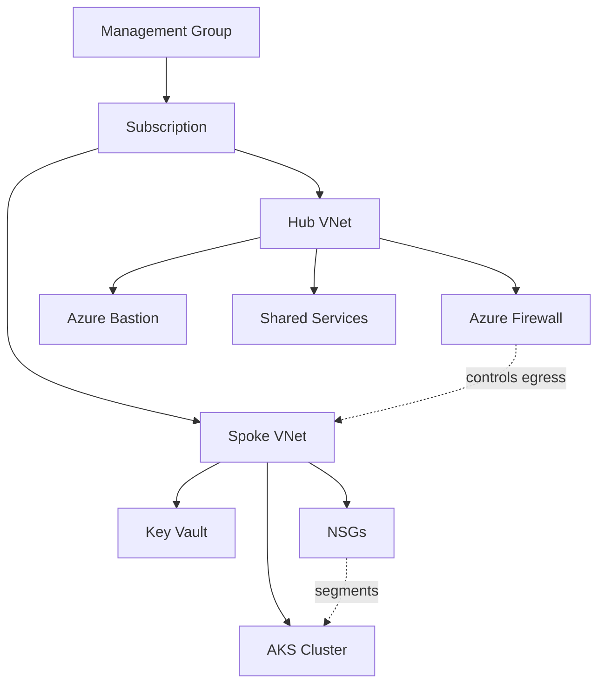
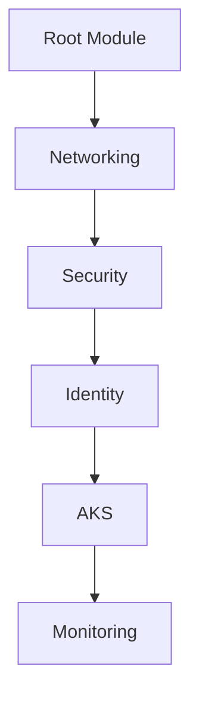
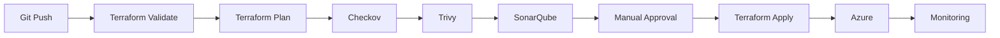
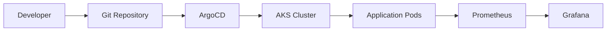
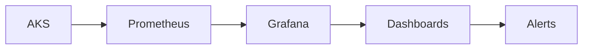

# Aniket Kumar

**Azure DevOps Engineer · DevSecOps · Platform Automation**

I design Azure infrastructure as Terraform modules, then gate every change through security scanning and policy checks before it reaches `apply`.

 

## About

My focus is Azure infrastructure built with Terraform, with DevSecOps controls (Trivy, Checkov, SonarQube) enforced as pipeline gates rather than post-deployment audits. I treat infrastructure like application code: modularized, version-controlled, and reviewed before it ships.

These are self-built projects, not enterprise production systems — each one is designed to reflect the patterns a real production environment would need (private networking, least-privilege access, policy gates), so that's the level of judgment on display here, not the scale.

 

## Stack

<table>
<tr>
<td valign="top" width="50%">

**Cloud**
 

Azure · Azure DevOps · Azure Entra ID

**Infrastructure as Code**
 

Terraform · Bicep · Ansible

**Containers & Orchestration**
 

Docker · Kubernetes · Helm · ArgoCD

</td>
<td valign="top" width="50%">

**CI/CD**
 

Azure Pipelines · GitHub Actions · Jenkins

**DevSecOps**

Trivy · Checkov · SonarQube · Azure Key Vault · HashiCorp Vault (basics)

**Monitoring**
 

Prometheus · Grafana

**Languages & VCS**
 

</td>
</tr>
</table>

 

## Featured Repositories

> Fill in the `Repository` and `Stack` columns with real links once pinned. Structure only — no repo names invented below.

| # | Repository | Stack | What it demonstrates |
|---|---|---|---|
| 1 | _[link]_ | Terraform · Azure | CAF-aligned landing zone, hub-and-spoke networking |
| 2 | _[link]_ | Terraform · AKS | Private cluster, managed identity, no static credentials |
| 3 | _[link]_ | Azure Pipelines · Trivy · Checkov · SonarQube | Security scans as hard gates before `apply` |
| 4 | _[link]_ | ArgoCD · Helm · Kubernetes | Git-reconciled deployments, drift correction |
| 5 | _[link]_ | Prometheus · Grafana | Metrics and dashboards provisioned with infra |

 

## Projects

### Azure Landing Zone — Terraform

**Problem:** A landing zone is only useful if teams can extend it without copy-pasting Terraform. A single monolithic config doesn't survive a second environment.

**Architecture:**

**Design decisions:**
- Structured around Microsoft's Cloud Adoption Framework rather than an ad-hoc layout, so the resource hierarchy matches what a reviewer coming from another CAF-based environment would already expect
- Hub-and-spoke networking with NSGs at the spoke boundary — segmentation is enforced at the network layer, not left to convention
- Azure Bastion instead of public IPs/jump boxes on VMs — removes an entire class of exposed-management-port misconfiguration
- RBAC scoped per resource group, not subscription-wide — least privilege as a default, not an afterthought

**Security considerations:**
- No public IPs on management interfaces — Bastion is the only path to compute
- Firewall sits in the hub and mediates spoke egress rather than each spoke managing its own perimeter
- Key Vault access policies scoped to the identities that need them, not broadly granted

**Outcome:** A set of parameterized Terraform modules that can stand up a new environment (dev/stage/prod-shaped) by changing variables, not rewriting configuration.

| Component | Implementation |
|---|---|
| Networking | Hub-and-spoke, NSGs, Azure Bastion |
| Identity & Access | RBAC, least-privilege scoping |
| Secrets | Azure Key Vault |
| Structure | Resource organization by environment boundary |
| Reusability | Modularized, parameterized Terraform |

**Repository:** _[link placeholder — add once pinned]_
**Documentation:** _[README / architecture doc placeholder]_

### AKS Production Infrastructure — Terraform

**Problem:** Default AKS quickstarts expose the API server publicly and use static credentials for registry access — neither is something a production cluster should ship with.

**Terraform module structure:**

**Design decisions:**
- Private networking for the control plane, closing off the most common AKS misconfiguration
- Managed Identity for AKS→ACR authentication instead of stored service principal credentials — nothing to rotate, nothing to leak
- Monitoring provisioned in the same Terraform run as the cluster, so observability isn't a manual step someone forgets after the fact
- Module ordering follows a strict dependency chain — identity exists before AKS references it, monitoring attaches only after the cluster is up

**Security considerations:**
- No static credentials anywhere in the AKS↔ACR trust path
- Control plane not reachable from the public internet
- Each module only receives the inputs it needs, not the full variable set

**Outcome:** An AKS + ACR pair where the trust relationship is identity-based end to end, provisioned as one reproducible Terraform apply.

**Repository:** _[link placeholder — add once pinned]_
**Documentation:** _[README / architecture doc placeholder]_

### Azure DevOps CI/CD Pipeline

**Problem:** Security scanning that runs *after* deployment only tells you what already broke. The gate needs to sit before `apply`, not after.

**Pipeline flow:**

**Design decisions:**
- Trivy and Checkov run against the Terraform plan output, not the live infrastructure — issues get caught before anything is provisioned
- SonarQube quality gates block on code smell / maintainability thresholds, not just pass/fail test results
- Manual approval sits between `plan` and `apply` deliberately — automated gates catch known issues, but infra changes still get a human review before they're irreversible

**Security considerations:**
- Static analysis runs before any resource is created, not after
- Approval gate means no single automated failure — or single reviewer — can push infra to `apply` alone
- Pipeline fails closed: any scan failure blocks progression by default

**Outcome:** No infrastructure change reaches `apply` without passing static analysis and a human sign-off — the pipeline enforces this, not a checklist.

**Repository:** _[link placeholder — add once pinned]_
**Documentation:** _[README / pipeline doc placeholder]_

### GitOps Deployment — ArgoCD + Helm

**Problem:** Manual `kubectl apply` means cluster state and Git history diverge silently over time, and nobody notices until something breaks.

**Workflow:**

**Design decisions:**
- Helm charts define desired state as versioned, reviewable artifacts instead of imperative commands
- ArgoCD continuously reconciles live cluster state against Git — drift is corrected automatically rather than discovered during an incident

**Security considerations:**
- No direct `kubectl` access needed for deployment — reduces the number of credentials with cluster-write access
- ArgoCD's sync state gives an audit trail of what changed and when, tied back to a Git commit

**Outcome:** Git is the actual source of truth for what's running, not a record of what was *supposed* to be applied.

**Repository:** _[link placeholder — add once pinned]_
**Documentation:** _[README / workflow doc placeholder]_

### Monitoring Stack — Prometheus + Grafana

**Problem:** Observability bolted on after infrastructure exists usually means half the metrics you need were never exposed.

**Architecture:**

**Design decisions:**
- Prometheus and Grafana provisioned in the same IaC workflow as the infrastructure they monitor, so dashboards exist from day one instead of being retrofitted

**Outcome:** Metrics and dashboards ship with the infrastructure, not as a follow-up task.

**Repository:** _[link placeholder — add once pinned]_
**Documentation:** _[README / dashboard doc placeholder]_

 

## GitHub Activity

<table>
<tr>
<td></td>
<td></td>
</tr>
</table>

 

## Engineering Principles

- Infrastructure is reviewed before it is deployed, not after.
- Security checks are enforced in the pipeline, not left to manual process.
- Identity-based access is preferred over stored secrets wherever the platform supports it.
- Repetitive operations get automated rather than repeated by hand.
- If it isn't reproducible from code, it isn't finished.

 

## Currently Working On

| Area | Specifically |
|---|---|
| Governance | Azure Policy at the landing-zone level |
| Kubernetes Security | OPA and Kyverno for admission control |
| Terraform | Module testing practices |
| Control Planes | Crossplane as an alternative to direct provider modules |

 

## Contact

