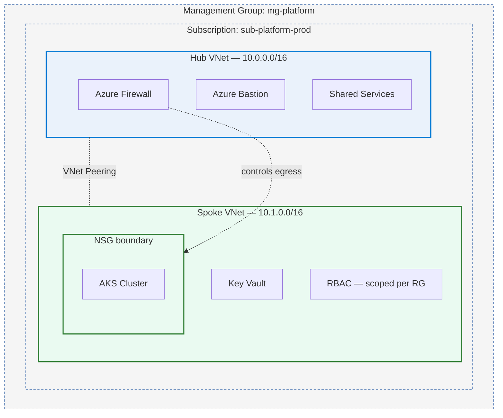
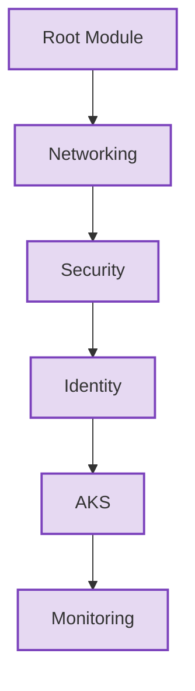
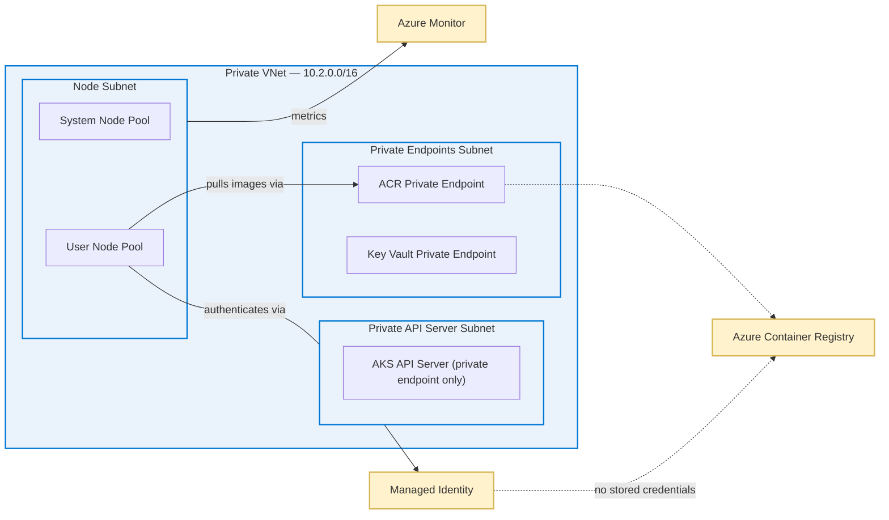
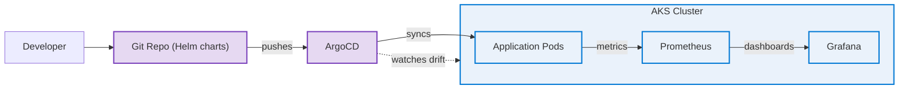
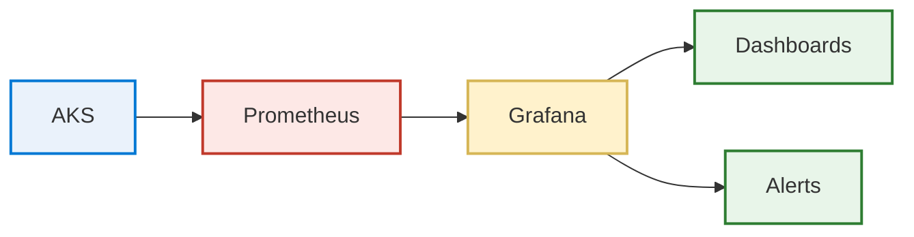

# Aniket Kumar

**DevOps Fresher — Azure, Terraform, Kubernetes**

One year of internship experience, spent mostly figuring out how to make small Azure environments in Terraform behave like they'd survive a code review, not just a demo.

 

## About

I think about infrastructure the same way I'd want to think about application code: if it's not in version control and it's not repeatable, I don't fully trust it. That's basically why I use Terraform instead of clicking through the portal — not because click-ops doesn't work, but because I can't review a click, and I can review a diff.

The automation side comes from the same place. Anything I find myself doing by hand more than twice, I try to script or put in a pipeline, mostly because I'm not disciplined enough to do a manual step correctly the same way every time.

Security in CI/CD is the part I care about most right now, honestly because it's the part I got wrong first. Early on I had scans running after deployment, which meant they were really just telling me what I'd already broken. Moving the checks before `apply` was the single change that made the rest of this feel like an actual pipeline instead of a script that happens to run in order.

 

## Tech Stack

Only listing what shows up in the repos below — not a wishlist.

| Area | Tools |
|---|---|
| Cloud | Azure, Azure DevOps |
| IaC | Terraform |
| Containers | Docker, Kubernetes, Helm |
| GitOps | ArgoCD |
| CI/CD | Azure Pipelines, GitHub Actions (personal repos) |
| Security scanning | Trivy, Checkov, SonarQube, Azure Key Vault |
| Monitoring | Prometheus, Grafana |
| Scripting | Python, Bash |

 

## Featured Repositories

Table structure is here so it's easy to keep updated as repos go public — links get added as each one is cleaned up, not before.

| # | Repository | Stack | What it demonstrates |
|---|---|---|---|
| 1 | _(link pending)_ | Terraform, Azure | Hub-and-spoke landing zone, per-RG RBAC |
| 2 | _(link pending)_ | Terraform, AKS | Private cluster, managed identity to ACR, no static creds |
| 3 | _(link pending)_ | Azure Pipelines, Trivy, Checkov, SonarQube | Scans gate `apply`, pipeline fails closed |
| 4 | _(link pending)_ | ArgoCD, Helm | Git-reconciled deploys, drift detection |
| 5 | _(link pending)_ | Prometheus, Grafana | Monitoring provisioned with the infra it watches |

 

## Projects

### 1. Azure Landing Zone in Terraform

This one started because I kept copy-pasting the same networking module between two "environments" and got tired of it. So I rebuilt it as a proper hub-and-spoke setup instead of a single flat network.

What I went with, and why:

- Hub-and-spoke so the firewall and Bastion live in one place instead of every spoke reinventing them
- NSGs at the spoke boundary so the AKS subnet isn't just trusting whatever's on the VNet by default
- Bastion instead of a jump box with a public IP — an earlier version of this project actually had a public-IP test VM "just for now," so this was a deliberate fix, not the original design
- RBAC scoped to the resource group rather than the subscription, mainly so one broad role assignment doesn't end up covering things it shouldn't

Parameterizing it so a second environment is a tfvars change instead of a copy-paste was the real goal here — the security patterns came along with doing it properly, more than being the starting point.

**Repo:** _(link pending — cleaning up hardcoded test values first)_

 

### 2. Private AKS Cluster + ACR, no static credentials

Default AKS quickstarts leave the API server public and use a service principal secret for pulling from ACR. Wanted to see if I could avoid both.

The module split (networking → security → identity → AKS → monitoring) came out of trial and error, not upfront planning. I originally had it all in one module and Terraform kept trying to create things in an order that didn't respect the actual dependencies. Splitting it made the dependency chain explicit and fixed the ordering problem.

Core thing I wanted: AKS authenticating to ACR through a managed identity, nothing to rotate, nothing that could end up in a `.tfvars` file by accident. Private endpoints for ACR and Key Vault so traffic stays off the public endpoint even from inside the VNet.

What I haven't done: any real load testing, or tried to break the private endpoint routing under actual traffic. It's only ever run with a couple of test pods.

**Repo:** _(link pending — cleaning up hardcoded test values first)_

 

### 3. A pipeline that blocks bad Terraform instead of just reporting on it

Most of the pipeline examples I found online run security scans after you've already applied. By then the scan is just confirming what you already broke.

```mermaid
flowchart LR
    GIT["Git Push"] --> VAL["Terraform Validate"]
    VAL --> PLAN["Terraform Plan"]
    PLAN --> GATE

    subgraph GATE["Security Gate"]
        direction TB
        CHECKOV["Checkov — IaC scan"]
        TRIVY["Trivy — vuln scan"]
        SONAR["SonarQube — quality gate"]
    end

    GATE --> APPROVE["Manual Approval"]
    APPROVE --> APPLY["Terraform Apply"]
    APPLY --> AZURE["Azure"]
    AZURE --> MON["Monitoring"]

    classDef tf fill:#e6d9f2,stroke:#7B42BC,stroke-width:2px
    classDef gate fill:#fde8e6,stroke:#c0392b,stroke-width:2px
    classDef approve fill:#fff2cc,stroke:#d6b656,stroke-width:2px
    classDef azure fill:#dae8fc,stroke:#0078D4,stroke-width:2px
    class VAL,PLAN,APPLY tf
    class GATE,CHECKOV,TRIVY,SONAR gate
    class APPROVE approve
    class AZURE,MON azure
```

Checkov and Trivy run against the `terraform plan` output before anything gets created, alongside a SonarQube quality gate. If any of them fail, the pipeline stops — it doesn't warn and continue, which is what an early version of this did before I realized that defeats the point of having a gate at all.

There's a manual approval step between plan and apply on purpose. Scans catch known issues, but I still wanted a point where I read the plan output myself before anything irreversible happens — a habit from a Terraform apply during the internship that did something I hadn't expected.

**Repo:** _(link pending — cleaning up hardcoded test values first)_

 

### 4. GitOps deploys with ArgoCD

Got tired of `kubectl apply`-ing by hand and then forgetting a week later exactly what I'd changed, so I moved deployments to ArgoCD.

Helm charts hold the desired state, ArgoCD reconciles the cluster against them and flags drift instead of me discovering a change only once something's already crash-looping. Side benefit I didn't originally plan for: I stopped needing a `kubectl` context with write access on my own laptop for routine deploys.

This is the smallest and most textbook of the five projects — built mainly to get comfortable with the sync/drift workflow itself, not because I ran into a particularly interesting problem along the way.

**Repo:** _(link pending — cleaning up hardcoded test values first)_

 

### 5. Monitoring with Prometheus + Grafana

The least developed of the five, and I'd rather say that upfront than pad it out. The point was to stop treating monitoring as something you bolt on after infrastructure exists.

Prometheus and Grafana get provisioned in the same Terraform run as the cluster, so dashboards exist from the first `apply` instead of being something I remember to add three weeks in. Alerting is still just the defaults — building out real alert rules is the obvious next step, not something I've done yet.

**Repo:** _(link pending — cleaning up hardcoded test values first)_

 

## Architecture notes

The diagrams above are Mermaid, mainly so they render directly on GitHub without extra setup, and they only show resources that are actually in each Terraform module — nothing added for looks. For a version with proper Azure iconography (closer to what you'd see in the Azure Architecture Center), the plan is to redraw the landing-zone and AKS diagrams in draw.io once I'm done iterating on the modules themselves — no point polishing a diagram for infrastructure that's still changing shape.

 

## Why validation happens before apply

The CI/CD project above is really the answer to one question: what's the cost of finding out something's wrong? Running Checkov and Trivy against `terraform plan` output means the cost is a failed pipeline run. Running them after deployment means the cost is whatever that misconfigured resource was exposed to in the meantime. Once I framed it that way, "gate before apply" stopped being a nice-to-have and became the only version of the pipeline that made sense to build.

## Why reconciliation instead of manual deploys

Manual `kubectl apply` means the cluster and the Git repo can quietly disagree with each other, and nothing tells you until something breaks. ArgoCD's continuous reconciliation just removes that gap — the cluster is either in sync with Git or ArgoCD is telling me it isn't. It's a small change in workflow that removes an entire category of "wait, who changed this" debugging.

## Why monitoring ships with the infrastructure

If observability is a follow-up task, it competes with whatever's next on the list and usually loses. Provisioning Prometheus and Grafana in the same Terraform run as the cluster means there's no "add monitoring later" step to forget — the dashboards exist because the infrastructure exists, not because someone remembered to circle back.

 

## Engineering principles these repos actually demonstrate

- Prefer managed identities over long-lived secrets, where the resource supports it
- Treat infrastructure as version-controlled, reviewable code — not console changes
- Fail during validation and plan, not after something's already applied
- Build a reusable module before duplicating the same config a second time
- Provision monitoring alongside the platform, not as a follow-up task

 

## GitHub Activity

<table>
<tr>
<td></td>
<td></td>
</tr>
</table>

 

## Currently working on

- Azure Policy at the landing-zone level — governance I skipped the first time around
- OPA / Kyverno for admission control on the AKS project
- Actually testing Terraform modules instead of just running `plan` and eyeballing the output
- Looking at Crossplane as an alternative to the provider modules I've been using — no strong opinion yet, just curious

 

## Contact

